# Automated IAM Incident Response on AWS

## Context and Business Impact

iCorp is a fictional B2B SaaS company that processes payments for enterprise clients. Its AWS environment (S3 buckets) holds customer PII, transaction records, and contract documents all of which are accessible via IAM service account credentials.
<p></p>
Recently, a threat actor obtained a valid access key through a phishing campaign. The key was used from a known malicious IP address to enumerate S3 buckets and begin exfiltration. Because the SOC had no automation in place, the alert sat unnoticed in GuardDuty until an analyst opened the console the following morning, resulting in an exposure window of 10 to 16 hours.
<p></p>
The goal of this project is to automate the response process, requiring zero human intervention for containment and reduce the total Mean Time to Respond (MTTR) to approximately one minute. This reduces the exposure window by about 99%. Note that while the overall response is near-instantaneous, the total time to detect still depends on how quickly GuardDuty identifies and publishes the finding.
<p></p>
Once a compromised IAM credential is detected via GuardDuty, the automated workflow immediately revokes the access key, locks the identity with an explicit "Deny-All" policy via an AWS Lambda function, records a structured incident case in DynamoDB, and alerts the security team via email. This entire orchestration occurs within the same minute GuardDuty publishes the finding.


## Architecture

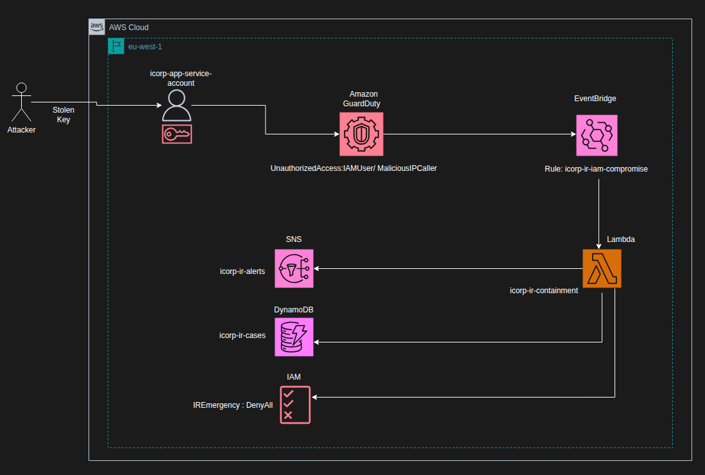
<p></p>

## Threat model (STRIDE)
To structure the security design, I used the STRIDE framework a simple but powerful way to think about threats in cloud environments.
<p></p>

| Category | Threat | Control |
|---|---|---|
| **Spoofing** | Stolen long-lived access key used from a malicious IP to impersonate `icorp-app-service-account` | GuardDuty `MaliciousIPCaller` detection triggers automated key revocation within 60s of finding publication |
| **Tampering** | Attacker escalates privileges via `iam:AttachUserPolicy` to gain broader access before containment | `IREmergencyDenyAll` inline Deny-All policy applied to identity — all subsequent API calls blocked regardless of attached permissions |
| **Repudiation** | Attacker disables CloudTrail to erase evidence of API activity and cover lateral movement | CloudTrail log file validation enabled + S3 MFA delete on log bucket prevents tampering with audit trail |
| **Information Disclosure** | Attacker enumerates S3 buckets and exfiltrates customer PII before GuardDuty publishes the finding | GuardDuty S3 Protection enabled; ~5-10 minute detection window limits exfiltration volume |
| **Denial of Service** | Stolen key used to mass-terminate EC2 instances or delete RDS snapshots to cause production outage | Key revocation and Deny-All policy stop all destructive API calls within seconds of Lambda execution |
| **Elevation of Privilege** | `sts:AssumeRole` called to pivot from the compromised service account to a more privileged admin role | Deny-All policy blocks `AssumeRole` post-containment; 5-10 minute GuardDuty detection window is the primary risk surface |

## Technical Steps

### 1. Lab Setup

For this lab i will use a free tier AWS account, with an IAM user for cli and console, for the region i choosed eu-west-1 (Ireland) as it provide low latency from Morocco.  
/!\ if you want to reproduce this lab please make sure to set budget alerts and teardown the lab after finishing to avoid any unexpected charges.

```bash
# Verify CLI is configured
aws sts get-caller-identity

# Set region and account ID for the whole session
export AWS_DEFAULT_REGION=eu-west-1
export ACCOUNT_ID=123456789
```

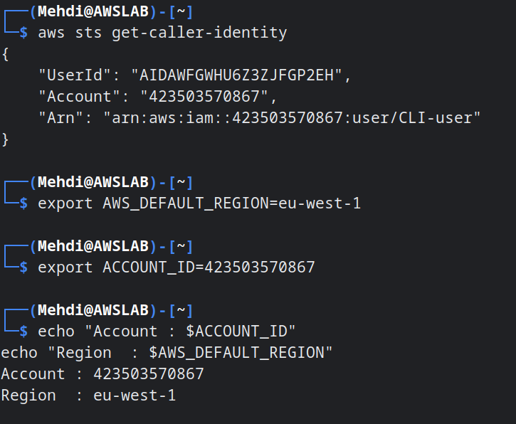
<p></p>

### 2. Enable GuardDuty and Generate sample findings

```bash
# I have already enabled GuardDuty, for first time use the following command
aws guardduty create-detector --enable --finding-publishing-frequency FIFTEEN_MINUTES

# Save detector ID
export DETECTOR_ID=$(aws guardduty list-detectors --query 'DetectorIds[0]' --output text)

# Conrfirm Enabled
aws guardduty get-detector --detector-id $DETECTOR_ID --query '{Status: Status}'
```

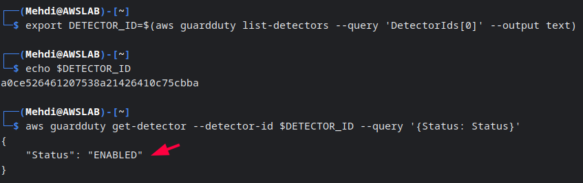    
<p></p>

GuardDuty offer the posibility to generate safe sample findings similar to real attacks that we can use to test out incident response flow.  
For this scenario i choosed to use "UnauthorizedAccess:IAMUser/MaliciousIPCaller" finding to simulate the leak of user Access Key and usage by Known Malicious IP.

```bash
# Generate sample findings
aws guardduty create-sample-findings  --detector-id $DETECTOR_ID  --finding-types "UnauthorizedAccess:IAMUser/MaliciousIPCaller"

# List the MaliciousIPCaller finding ID
aws guardduty list-findings --detector-id $DETECTOR_ID --finding-criteria '{"Criterion":{"type":{"Eq":["UnauthorizedAccess:IAMUser/MaliciousIPCaller"]}}}' --query 'FindingIds'

# Save finding ID
export FINDING_ID={Replace_with_FINDING_ID}

# Visualise finding JSON details
aws guardduty get-findings --detector-id $DETECTOR_ID --finding-ids $FINDING_ID --query 'Findings[0]'

```
<p></p>
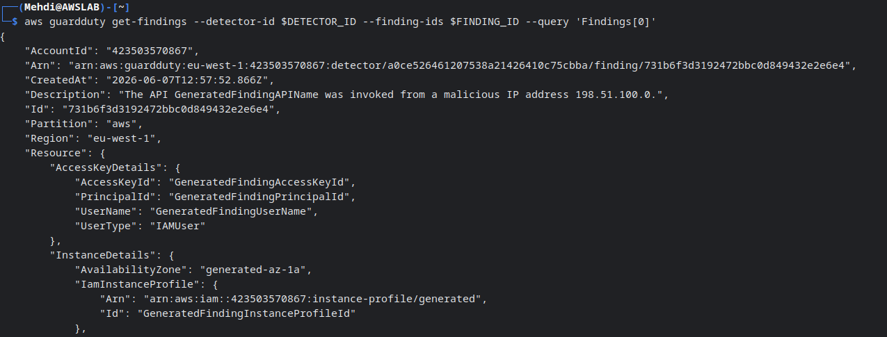
<p></p>

We can also visualise the finding via the GUI console

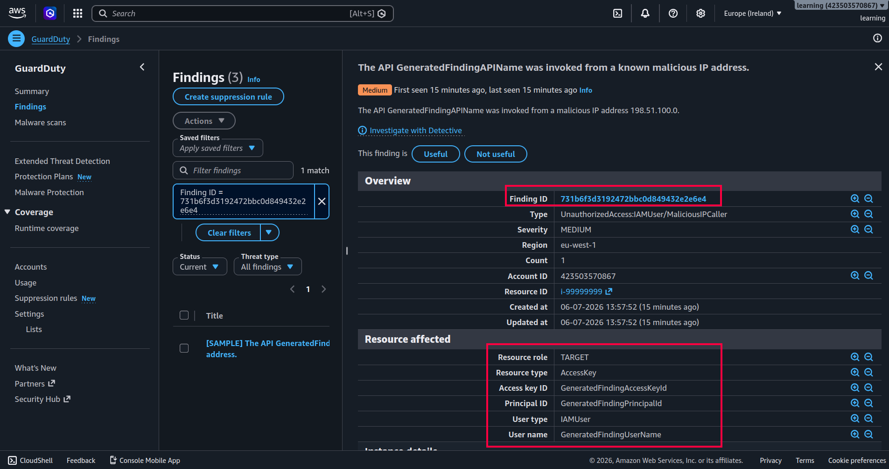
<p></p>
<p></p>

### 3. Create the IAM Victim UserAccount  
The victim user will be an app service account that have access to an S3 bucket.  

```bash
# Create the victim service account
aws iam create-user --user-name icorp-app-service-account

# Attach an S3 scoped policy
aws iam attach-user-policy --user-name icorp-app-service-account --policy-arn arn:aws:iam::aws:policy/AmazonS3ReadOnlyAccess

# Create access key (this is what gets revoked during containment)
aws iam create-access-key --user-name icorp-app-service-account > victim_key.json

cat victim_key.json

# Save key ID for use throughout the lab
export VICTIM_KEY_ID={Replace_by_VICTIM_KEY_ID}
```

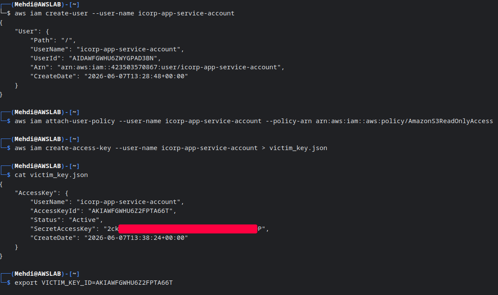
<p></p>

### 4. Create the Lambda Execution Role  
For the lambda function to be able to automate the IR actions we need to grant it the needed permissions for iam user containment (key revocation and deny all policy attachment),sns and dynamodb.  

```bash
# Trust policy (this policy will allow the lambda service to assume the role)
cat > lambda-trust-policy.json << 'EOF'
{
  "Version": "2012-10-17",
  "Statement": [{
    "Effect": "Allow",
    "Principal": { "Service": "lambda.amazonaws.com" },
    "Action": "sts:AssumeRole"
  }]
}
EOF

# Create the role
aws iam create-role --role-name icorp-IR-lambda-role --assume-role-policy-document file://lambda-trust-policy.json --description "Execution role for iCorp IR containment lambda"

# Save role ARN
export LAMBDA_ROLE_ARN={Replace_with_ROLE_ARN}

# Attach managed policies
for policy in \
  "IAMFullAccess" \
  "AmazonDynamoDBFullAccess" \
  "AmazonSNSFullAccess" \
  "service-role/AWSLambdaBasicExecutionRole"; do
    aws iam attach-role-policy \
      --role-name icorp-IR-lambda-role \
      --policy-arn arn:aws:iam::aws:policy/$policy
    echo "Attached: $policy"
done

# Confirm all four attached
aws iam list-attached-role-policies --role-name icorp-IR-lambda-role --query 'AttachedPolicies[].PolicyName'
```
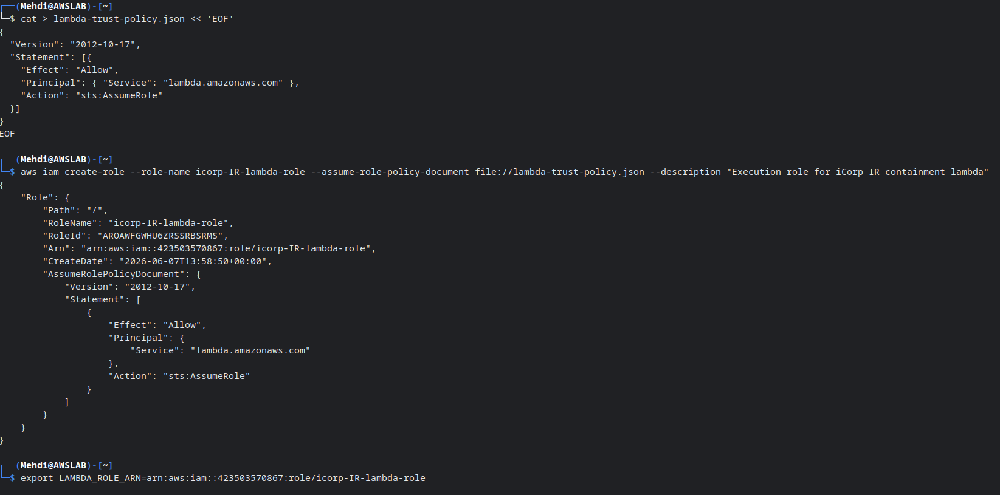
<p></p>
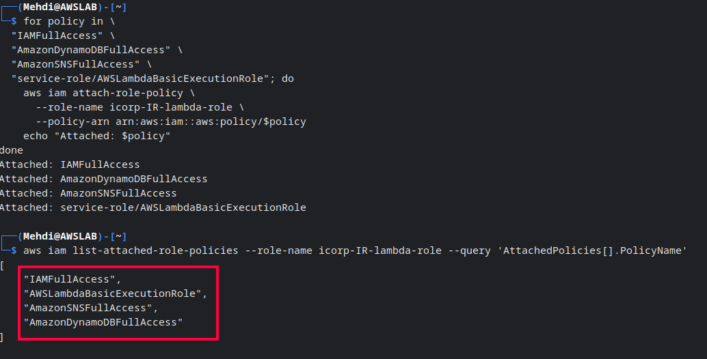
<p></p>

### 5. Create DynamoDB Case Records Table  
This DynamoDb table will serve as a case record for the soc analyst/security engineer to view the affected user,key  

```bash
# Create the table
aws dynamodb create-table --table-name icorp-IR-cases \
--attribute-definitions AttributeName=case_id,AttributeType=S \
--key-schema AttributeName=case_id,KeyType=HASH --billing-mode PAY_PER_REQUEST

# Wait for active Status
aws dynamodb wait table-exists --table-name icorp-IR-cases

# Confirm table creation
aws dynamodb describe-table --table-name icorp-IR-cases --query 'Table.{Name:TableName, Status:TableStatus}'

```
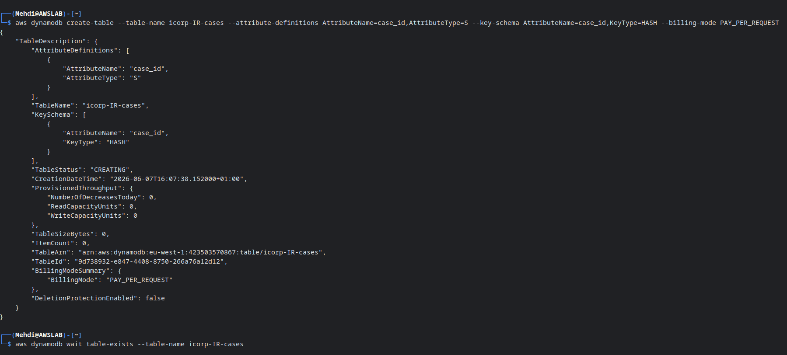
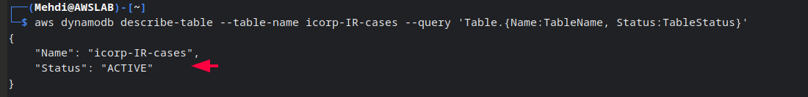
<p></p>

### 6. Create SNS Email and Subscribe Email  
To be able to receive instant email when an automated IR has been triggered we will create an SNS topic and subscribe to it using our email address.  
```bash
# Create topic
aws sns create-topic --name icorp-IR-alets

# Save ARN
export SNS_TOPIC_ARN={Replace_with_SNS_TOPIC_ARN}

# Subscribe
aws sns subscribe --topic-arn $SNS_TOPIC_ARN --protocol email --notification-endpoint {email address} 
```
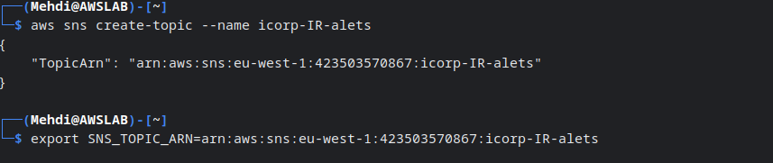
<p></p>
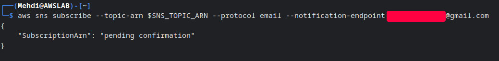
<p></p>
We will receive an email from aws to confirm our subscription to the topic.  

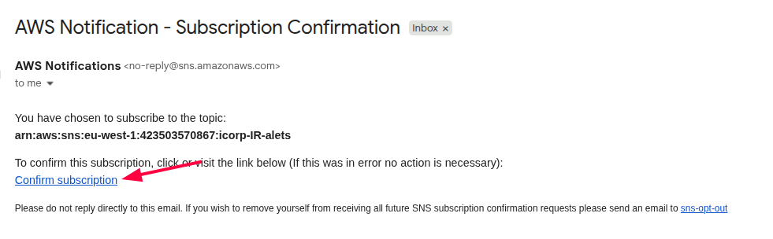
<p></p>  

```bash
# After confirming — verify subscription is live
aws sns list-subscriptions-by-topic --topic-arn $SNS_TOPIC_ARN \                                             
  --query 'Subscriptions[0].{Protocol:Protocol,Endpoint:Endpoint,Status:SubscriptionArn}'
```
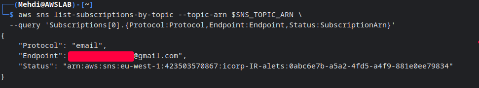
<p></p>  

### 7. Package and Deploy the Lambda  
The lambda function will be responsible of the containment flow after receiving the trigger from guardduty.  
the full function code -> [handler.py](https://github.com/ELMBoukhriss/Automated-IAM-Incident-Response-on-AWS/blob/main/lambda/handler.py)  

```bash
# Create the lambda handler.py zip it
nano handler.py
zip -r icorp-ir-containment.zip

# Deploy Lambda
aws lambda create-function --function-name icorp-IR-containment --runtime python3.12 --role $LAMBDA_ROLE_ARN --handler handler.lambda_handler \
--zip-file fileb://icorp-ir-containment.zip --timeout 30 --memory-size 128   --environment "Variables={DYNAMODB_TABLE=icorp-IR-cases,SNS_TOPIC_ARN=$SNS_TOPIC_ARN}" \
--description "iCorp IR: automated IAM containment on GuardDuty MaliciousIPCaller finding"

# Wait for active state
aws lambda wait function-active --function-name icorp-IR-containment

# Confirm deployed with env vars
aws lambda get-function-configuration --function-name icorp-IR-containment --query '{Name:FunctionName, State:State, Runtime:Runtime, Env:Environment.Variables}'
```
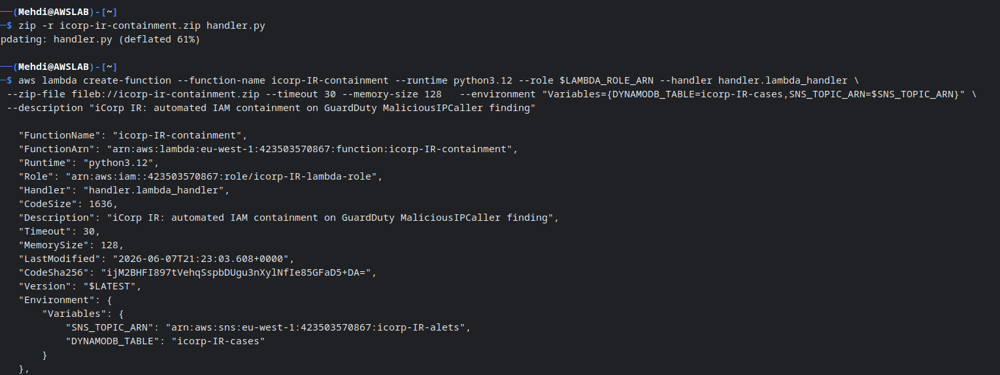
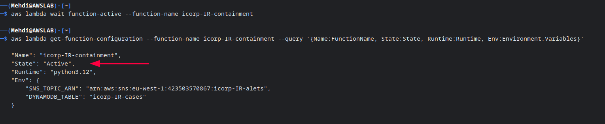
<p></p>
<p></p>

### 8. Create EventBridge Rule and Wire to Lambda
EventBridge is the intermediate that will connect the GuardDuty finding to the lambda function.  

```bash
# Write event pattern file ( if you notice i replcaed "aws.guardduty" with "icorp.guardduty" i will explain why in next Testing section.
cat > ir-event-pattern.json << 'EOF'{                   
  "source": ["icorp.guardduty"],
  "detail-type": ["GuardDuty Finding"],
  "detail": {
    "type": [
      "UnauthorizedAccess:IAMUser/MaliciousIPCaller"
    ]
  }
}
EOF

# Create Rule
aws events put-rule --name icorp-IR-iam-compromise --event-pattern file://ir-event-pattern.json \--state ENABLED --description "iCorp IR: route Guardduty IAM findings to containment Lambda"

# Save rule ARN
export RULE_ARN={Replace_with_Rule_ARN}

# Save Lambda ARN
export LAMBDA_ARN={Replace_with_Rule_ARN}

# Add Lambda as target
aws events put-targets --rule icorp-IR-iam-compromise --targets "Id=IRContainmentLambda,Arn=$LAMBDA_ARN"

# Grant EventBridge permission to invoke Lambda
aws lambda add-permission --function-name icorp-IR-containment --statement-id EventBridgeIRInvoke --action lambda:InvokeFunction --principal events.amazonaws.com --source-arn $RULE_ARN

# Verify the full setup
aws events describe-rule --name icorp-IR-iam-compromise --query '{Name:Name, State:State}'
aws lambda get-policy --function-name icorp-IR-containment --query 'Policy' --output text | python3 -m json.tool

```
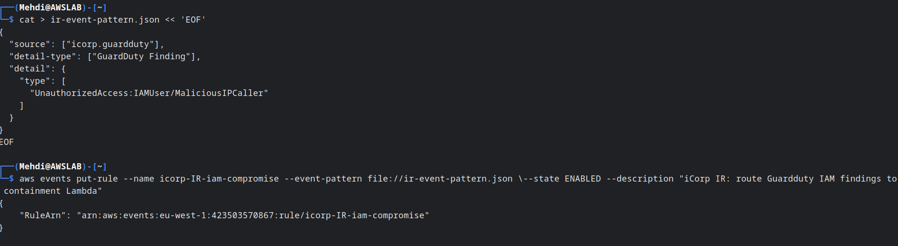
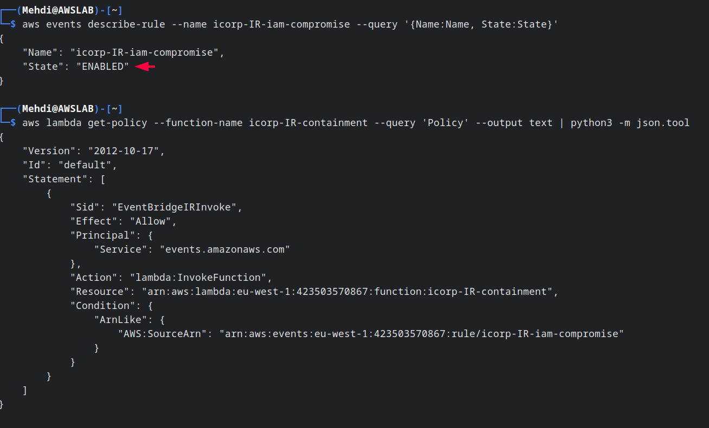
<p></p>
<p></p>

### 9. Test via EventBridge put-events
GuardDuty's "create-sample-findings" always injects "GeneratedFindingAccessKeyId" as a hardcoded placeholder,you cannot override it with a real key ID."put-events" bypasses that limitation entirely, letting you inject a fully-crafted GuardDuty-shaped event with your real victim key ID directlyinto EventBridge.this way the lambda will be able to apply the containment steps on the victim user via the key ID that why in the previous step i replaced "aws.guardduty" with custom "icorp.guardduty"
```bash
# Confirm victim key is still Active before the test
aws iam list-access-keys --user-name icorp-app-service-account --query 'AccessKeyMetadata[0].[AccessKeyId,Status]'

# Build the crafted GuardDuty-shaped event payload
 cat > ir-putevents-payload.json << EOF
[
  {
    "Source": "icorp.guardduty",
    "DetailType": "GuardDuty Finding",
    "EventBusName": "default",
    "Detail": "{\"type\": \"UnauthorizedAccess:IAMUser/MaliciousIPCaller\", \"severity\": 7, \"accountId\": \"$ACCOUNT_ID\", \"region\": \"$AWS_DEFAULT_REGION\", \"id\": \"ir-test-$(date +%s)\", \"resource\": {\"resourceType\": \"AccessKey\", \"accessKeyDetails\": {\"accessKeyId\": \"$VICTIM_KEY_ID\", \"userName\": \"$PROJECT-app-service-account\", \"userType\": \"IAMUser\", \"principalId\": \"AIDACKCEVSQ6C2EXAMPLE\"}}, \"service\": {\"action\": {\"actionType\": \"AWS_API_CALL\", \"awsApiCallAction\": {\"api\": \"ListBuckets\", \"serviceName\": \"s3.amazonaws.com\", \"remoteIpDetails\": {\"ipAddressV4\": \"203.0.113.42\", \"organization\": {\"asnOrg\": \"Malicious Actor ISP\"}, \"country\": {\"countryName\": \"Unknown\"}, \"city\": {\"cityName\": \"Unknown\"}}}}}}"
  }
]
EOF

# FIRE THE EVENT
aws events put-events --entries file:///tmp/ir-putevents-payload.json

```
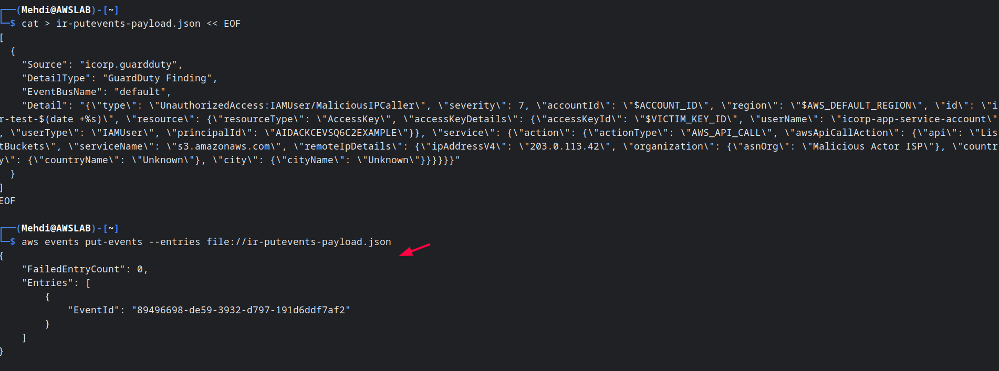
<p></p>
The alert email was sent near realtime after triggering the event
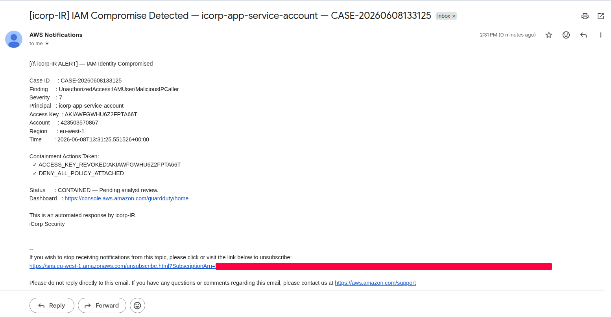
<p></p>

### 10. Verify Full Containment
```bash
# Verify access key is Inactive
aws iam list-access-keys --user-name icorp-app-service-account --query 'AccessKeyMetadata[0].{KeyId:AccessKeyId, Status:Status}'

# Verify Deny-All inline policy attached
aws iam list-user-policies --user-name icorp-app-service-account

# Verify DynamoDB case record 
aws iam get-user-policy --user-name icorp-app-service-account --policy-name IREmergencyDenyAll --query 'PolicyDocument'

```
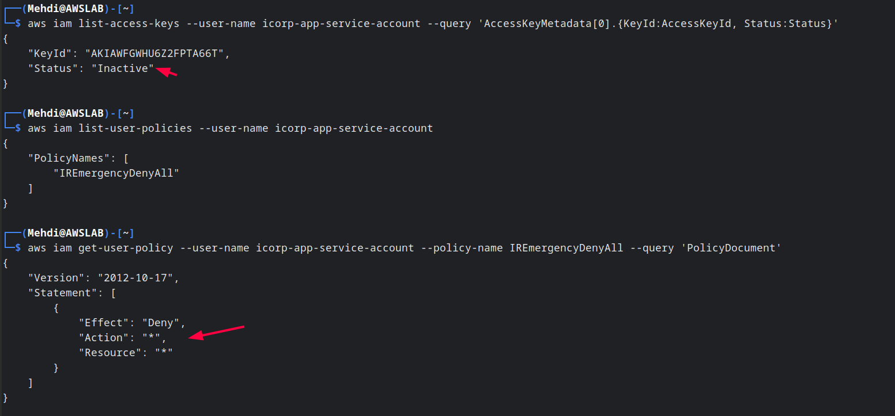
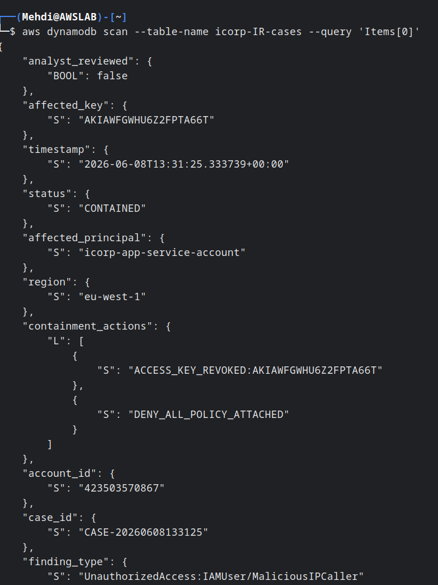

We can also verify via the console
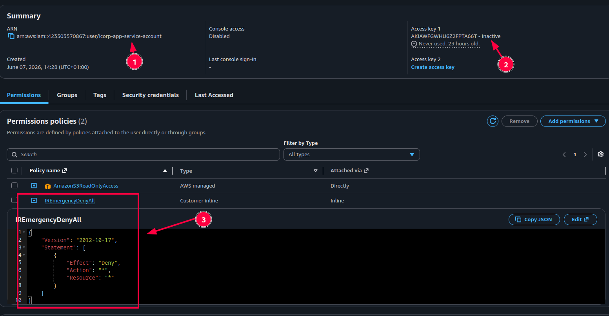
<p></p>

The containment of the user was successful and under 60sec, now the soc analyst/security engineer can view the dynamodb case record and start investigating the incident.

### 11. Teardown  
The final step is to teardown the lab to avoid any reccuring charges.
```bash
#GuardDuty
aws guardduty delete-detector --detector-id $DETECTOR_ID

# Lambda
aws lambda delete-function --function-name icorp-IR-containment

# EventBridge
aws events remove-targets --rule icorp-IR-iam-compromise --ids IRContainmentLambda

aws events delete-rule --name icorp-IR-iam-compromise

# SNS
aws sns unsubscribe --subscription-arn $SUBSCRIPTION_ARN
aws sns delete-topic --topic-arn $SNS_TOPIC_ARN

# DynamoDB
aws dynamodb delete-table --table-name icorp-IR-cases

# IAM victim user
aws iam detach-user-policy \
  --user-name icorp-app-service-account \
  --policy-arn arn:aws:iam::aws:policy/AmazonS3ReadOnlyAccess

# Delete inline policy if it still exists
aws iam delete-user-policy \
  --user-name icorp-app-service-account \
  --policy-name IREmergencyDenyAll 2>/dev/null || true

aws iam delete-access-key \
  --user-name icorp-app-service-account \
  --access-key-id $VICTIM_KEY_ID

aws iam delete-user --user-name icorp-app-service-account

#  IAM Lambda role
for policy in \
  "IAMFullAccess" \
  "AmazonDynamoDBFullAccess" \
  "AmazonSNSFullAccess" \
  "service-role/AWSLambdaBasicExecutionRole"; do
    aws iam detach-role-policy \
      --role-name icorp-IR-lambda-role \
      --policy-arn arn:aws:iam::aws:policy/$policy
done

aws iam delete-role --role-name icorp-IR-lambda-role
```

### 12. Terraform
[TODO] : Will be added Later


